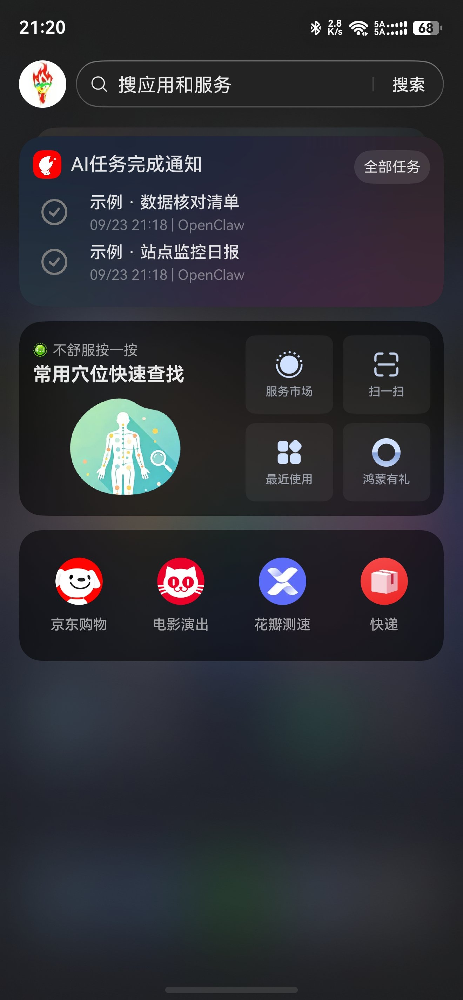
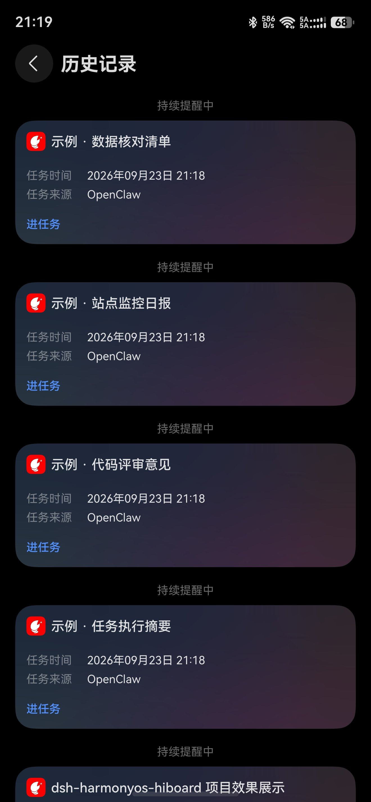
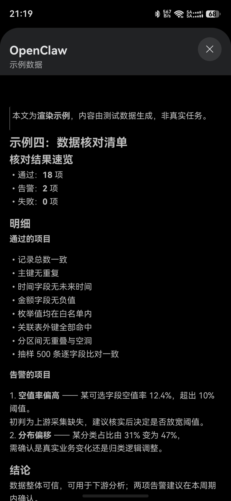

# 华为鸿蒙系统 DeepSeek Harness 对话结果负一屏卡片推送

**HarmonyOS DeepSeek Harness Result Push to Assistant-Today Cards**

[](LICENSE)
[](#)
[](#)
[](#)

把 **DeepSeek Harness（dsh）** 的对话与任务结果，以 **服务卡片** 形式推送到华为鸿蒙
**负一屏（智慧助手·今天）**，手机上点开即可看到完整的 Markdown 正文。

> 本仓库基于 [Entity-Him/dsh-hiboard-push](https://github.com/Entity-Him/dsh-hiboard-push)（MIT）修改，
> 修复了它在 **dsh 0.1.5 / cordis 4** 上的启动崩溃，并补齐了部署文档与卡片契约分析。
> 来源与改动逐条列于 [`NOTICE`](NOTICE)。

---

## 效果（真机截图）

<table>
<tr>
<td align="center" width="33%">

<br><b>① 负一屏卡片</b><br>
<sub>同一 schedule_id 的卡片会归到一组</sub>
</td>
<td align="center" width="33%">

<br><b>② 历史记录</b><br>
<sub>每条任务都有「进任务」入口</sub>
</td>
<td align="center" width="33%">

<br><b>③ 点开详情页</b><br>
<sub>完整 Markdown 正文，含渲染正常的表格 —— 这正是必须传 schedule_id 的原因</sub>
</td>
</tr>
</table>

> **测试环境**：HarmonyOS **7.0.0.107**，**仅测试了手机端**（未验证平板 / 折叠屏 / 手表等形态）。
> ③ 是项目介绍卡；①② 里带「示例」字样的卡片为测试数据，非真实任务记录。
> Markdown 支持范围与表格写法要求见 [兼容性](#兼容性) 一节。


---

## 效果

DSH 每完成一件事，agent 调用一次工具：

```
hiboard_push(
  name        = "磁盘健康检查",
  content     = "# 检查结果\n\n- C 盘：正常\n- D 盘：正常",
  result      = "已完成",
  schedule_id = "dsh_worklog"        # 关键，见下
)
```

手机负一屏出现卡片 → 点进去 → **完整 Markdown 正文**。

```
DSH agent ──调用 hiboard_push──► 华为 HIBoard 云侧 ──► 手机负一屏服务卡片
  (本插件注册的两个工具)            POST .../msg/upload
```

---

## ⚠️ 三个必须知道的坑

### 1. 卡片必须带 `scheduleTaskId`，否则正文完全不显示

这是本项目最有价值的实测结论（2026-09-23 对着线上服务验证）：

| 负载形态 | 手机上看到什么 |
|---|---|
| `scheduleTaskId` **为空** | 只有一行标题 + 时间 + 来源；**正文一行都不显示**，「进任务」深链点了没反应 |
| `scheduleTaskId` **非空** | **打开完整详情页，渲染整段 Markdown 正文** ✅ |

`content` 字段本身没问题（实测负载里带换行、序列化正确，接口也返回成功），
**平台只是不给"没有 scheduleTaskId"的卡片开放详情页**。

**结论：推送一律传 `schedule_id`。** 同一会话用同一个 ID，还能在负一屏里分组。

### 2. 授权码不能放 `~/.dsh/.env`

`DSH_HIBOARD_AUTH_CODE` 是 dsh 的 **bootstrap-only** 变量。写进 `.env` 会让 dsh
**直接拒绝启动**：

```
Error: dsh: ...\.env sets "DSH_HIBOARD_AUTH_CODE", which only the launching
       environment may set ...
```

正确做法：写进 profile 补丁层的插件 config（见下方部署）。

### 3. 上游版本会让新版 dsh 启动崩溃（本仓库已修）

上游使用 `@deepseek-ai/dsh-settings` 的 `installSettingsSection`，该 API 在 cordis 4 已移除：

```
SyntaxError: The requested module '@deepseek-ai/dsh-settings'
             does not provide an export named 'installSettingsSection'
TypeError: Cannot read properties of undefined (reading 'validate')
```

`src/lib/index.js` 是**已修复版**：摘掉失效的设置面板注册，推送逻辑完整保留；
上游原版留作 `src/lib/index.js.upstream-backup` 便于比对。

---

## 快速开始

前置：Windows / macOS / Linux + Node.js 18+ + dsh 已安装 + `pnpm` 已安装。

```bash
# 1) 克隆到一个「路径不含空格」的位置（pnpm 的 file: 依赖会被空格截断）
git clone https://github.com/MaybeMeibeMaybi/dsh-harmonyos-hiboard.git E:/dsh-vendor/dsh-harmonyos-hiboard

# 2) 安装为 dsh 插件
dsh plugin --profile web add "file:E:/dsh-vendor/dsh-harmonyos-hiboard"
```

**3) 写入授权码** —— 编辑 `~/.dsh/profiles/web/cordis.patch.yml`：

```yaml
- id: hiboard-push
  config:
    authCode: <你的授权码>
```

授权码获取：手机 **负一屏 → 我的 → 动态管理 → 关联账号 → Claw 智能体**。

**4) 重启 dsh**，然后让 agent 调用 `hiboard_push`（记得传 `schedule_id`）。

**5) 装推送兜底（强烈建议）** —— 不装的话，一旦 agent 把推送写成正文（见下节），
卡片会**静默消失**：

```bash
# 两个独立插件：push-guard（兜底）+ token-broadcast（启动推 token）
git clone https://github.com/MaybeMeibeMaybi/dsh-harmonyos-hiboard.git E:/dsh-vendor/dsh-push-guard
dsh plugin --profile web add "file:E:/dsh-vendor/dsh-push-guard/src/push-guard"
```

`~/.dsh/profiles/web/cordis.patch.yml`：

```yaml
- insert:
    - id: push-guard
      name: dsh-push-guard
      config:
        enabled: true
        rescueEnabled: true          # L1：抢救"写成纯文本的调用"
        promiseRescueEnabled: true   # L2：抢救"承诺了却没调用"
        retryEnabled: true           # L3：失败按类别重试
        authCode: <你的授权码>        # 与 hiboard-push 保持一致
```

> ⚠️ **同名 `insert` 条目只认第一个**。曾经 v1/v2 各写了一份，
> 后写的配置被**静默忽略**（排查了十几分钟）。升级时记得替换而不是追加。

完整步骤（含预检、排错、错误码）见 **[`docs/DEPLOY.md`](docs/DEPLOY.md)**。

---

## 提供的工具

| 工具 | 作用 |
|---|---|
| `hiboard_push` | 推送一张任务卡片：`name`（标题）、`content`（Markdown，≤5000 字符）、`result`（状态标签）、`schedule_id`（**必传**）、`dry_run`（只校验不发送） |
| `hiboard_verify` | 发送一张「连接测试」卡片，端到端验证授权码与网络 |
| `hiboard_push_selfcheck` | 由 `dsh-push-guard` 提供：报告兜底插件是否生效、`hiboard_push` 是否已被接管重试、授权码是否配置、接口是否可达、最近一次推送状态 |

---

## ⚠️ 第四个坑（最坑的一个）：推送会**静默丢失**

> 2026-09-27 实测事故：一晚连着 3 张卡片没到手机，而 dsh 界面**没有任何报错**。
> 完整复盘见 **[`docs/INCIDENT-2026-09-27-silent-push-loss.md`](docs/INCIDENT-2026-09-27-silent-push-loss.md)**。

工具不会自己调用 —— 而 **agent 可能"以为"自己调用了**。已实测到三种形态，全部是静默失败：

| 形态 | 长什么样 | 为什么没报错 |
|---|---|---|
| **A. 把调用写成正文** | 正文里出现 `<hiboard_push><parameter name="content">…` 这段 XML | 只是普通文本，`turn/end` 依然 `completed` |
| **B. 承诺了却没调用** | 正文写"我把结论推给你："，然后**什么调用都没有** | 同上，从会话记录看一切正常 |
| **C. 标签带额外属性** | `<parameter name="content" string="true">` | 朴素正则匹配不到 `content` → 被当成"参数不全"，安静放弃 |

### 修复：三级兜底插件 `src/push-guard/`

| 级别 | 触发条件 | 行为 |
|---|---|---|
| **L1 rescue** | 正文出现字面量调用标记，且**该轮**从未真正调用 `hiboard_push` | 用同一解析器还原参数，按原样代为推送 |
| **L2 promise** | 该轮未推送，但正文**明确承诺了推送**且正文够长 | 用该轮正文补推，`result` 标注"模型未调用推送工具" |
| **L3 retry** | 工具真调用了但返回失败 | **按错误类别**重试：瞬时可重试，永久错误（如 `0000900034`）不重试 |

关键实现细节（都是踩出来的）：

- 判定"本轮推过没有"用**轮次号**而非消息序号，否则"上一轮推过"会吃掉本轮的兜底；
- 解析 `<parameter>` 时正则必须允许**额外属性**（`[^>]*>`），否则形态 C 会漏；
- L2 的意图识别**保守优先**：`要不要我把结果推给你？`／`我不会推送这张卡片。` 都不触发；
- 插件的任何异常都内部吞掉并记日志 —— **绝不允许兜底逻辑把宿主 dsh 拖崩**。

### 可观测性（"彻底修好"的关键）

```
<DSH_HOME>/lan/push-guard/
├── startup.json      启动自检：authCode 是否配置、三级开关、pid
├── last-state.json   最近一次兜底推送（哪一轮、哪一级、成功与否）
└── audit.jsonl       流水：push-ok / push-failed / retry-ok / rescue-ok / no-push
```

装好之后，先让 agent 调一次 `hiboard_push_selfcheck` 确认三件事：
**兜底插件生效了、`hiboard_push` 被接管了、授权码配对了**。
在这之前，"保险丝到底有没有生效"只能靠猜 —— 本次事故里就真的猜错过一次。

---

## 网络契约

| 项 | 值 |
|---|---|
| 端点 | `POST https://hiboard-claw-drcn.ai.dbankcloud.cn/distribution/message/cloud/claw/msg/upload` |
| 鉴权 | 请求体中的 `authCode`（个人凭据） |
| 必填字段 | `msgId` `scheduleTaskId` `scheduleTaskName` `summary` `result` `content` `source` `taskFinishTime` |
| `source` | 固定 `"OpenClaw"`（平台按此值品牌化渲染，**不要改**） |
| 内容上限 | 5000 字符 |
| 成功码 | `0000000000`（也接受 `"0"`） |
| 授权码无效 | `0000900034` |
| 方法限制 | **仅 POST**（GET 返回 405） |

字段细节、卡片形态对照、全部错误码（含 `0200100004` 的 CP 子码含义）见
**[`docs/CARD-CONTRACT.md`](docs/CARD-CONTRACT.md)**。

---

## 让"每一轮回答都推送"对所有会话生效

工具不会自己调用。把规则写进 **全局指令文件** `~/.dsh/AGENTS.md`，
dsh 会在**每个会话**里自动加载它。现成模板见
**[`docs/AGENTS-rule.md`](docs/AGENTS-rule.md)**。

---

## 目录结构

```
.
├── README.md
├── LICENSE                                    MIT（含上游 Entity-Him 版权声明）
├── NOTICE                                     来源与改动声明
├── package.json
├── docs/
│   ├── images/                                真机截图（卡片 / 历史 / 详情页）
│   ├── DEPLOY.md                              从零部署（含排错表）
│   ├── CARD-CONTRACT.md                       负载契约 / 卡片形态 / 错误码
│   ├── AGENTS-rule.md                         全局推送规则模板
│   ├── INCIDENT-2026-09-27-silent-push-loss.md  ★ 推送静默丢失复盘（三级兜底的由来）
│   ├── UPDATES-2026-09-27.md                   ★ 兜底插件 / 可观测性 / token 卡片修复
│   └── UPDATES-2026-09-23.md                  演进汇总（含 token 推送插件）
└── src/
    ├── lib/index.js                           插件源码（兼容性修复版）
    ├── lib/index.js.upstream-backup           上游原始版本，便于比对
    ├── package.json
    ├── cordis.patch.yml                       bundle 补丁（挂载插件用）
    ├── push-guard/                            ★ 推送兜底插件（L1/L2/L3 + 自检 + 审计）
    │   ├── lib/index.js
    │   └── package.json
    └── token-broadcast/                       ★ 启动即推送 token 的插件
        ├── lib/index.js
        └── package.json
```

---

## 进阶用法：dsh 每次启动自动推一张 token 卡片

`src/token-broadcast/` 是一个独立插件，解决一个很实际的问题：
**dsh 的会话 token 只在启动时打印一次到 stdout、不落盘**，
而手机上经常要用到它（例如给 HTTPS 网关授权会话），手工翻日志很麻烦。

它做三件事：

1. 等 dsh 启动器把**本次运行**的 token 写进 `<用户目录>/.dsh/lan/web-state.json`
2. 推一张 token 负一屏卡片（**必须带非空 `scheduleTaskId`**，否则不渲染正文），
   卡片里的**网关地址与局域网地址都写真实 IP**（见下）
3. 可选：把 token 用**注册密钥**上报给你自己的网关，让浏览器只输密码即可进入

### 两个 2026-09-27 修掉的实际问题

1. **地址曾经是占位符**：卡片正文里原本写的是
   `https://<服务器IP>:18443/?token=…` 和 `http://<电脑IP>:3081/?token=…` ——
   手机上根本没法用。现在：
   - 网关主机从 `registerUrl` 推导（也可用 `gatewayHost` 显式指定）；
   - 局域网 IP **每次启动动态探测**（`os.networkInterfaces()` 取第一个非内部 IPv4）。
     实测：同一天内换网，局域网 IP 就从 `192.168.0.x` 段变成了 `192.168.3.x` 段 ——
     **写死必然过期**。
2. **会推送上次的失效 token**：`web-state.json` 在 dsh 退出时**不会被删除**，
   上一轮的 token 一直躺在里面。原实现一读到就推，可能把**已失效的 token** 推给用户
   （比不推更糟：用户拿着旧 token 反复试）。现在会校验文件里的 `pid` / `startedAt`
   是否属于**本次运行**，只有确认新鲜才推。

安装与配置：

```bash
dsh plugin --profile web add "file:E:/dsh-vendor/dsh-token-broadcast"
```

`~/.dsh/profiles/web/cordis.patch.yml`：

```yaml
- insert:
    - id: token-broadcast
      name: dsh-token-broadcast
      config:
        enabled: true
        authCode: <AUTH_CODE>
        scheduleId: dsh_token_notice
        # 可选：网关注册（见 dsh-aliyun-relay-access 项目）
        registerUrl: 'https://<GATEWAY-HOST>:18443/__gw_register'
        registerKeyPath: '<你的密钥文件路径>'
        registerInsecure: true    # 网关用自签证书时；对负一屏仍保持严格校验
        # 可选：留空则自动探测/推导，一般不需要填
        # gatewayHost: '<GATEWAY-HOST>:18443'
        # lanIp: '<LAN-IP>'
        # lanPort: 3081
```

### 两个实测教训（写在了源码注释里）

1. **schemastery 的 `.default()` 不会随 `{...Config}` 展开生效** ——
   `Config` 是 schema 对象，展开只能拿到 schema 自身属性，拿不到默认值。
   所以默认值写成独立常量 `DEFAULTS` 并在 `apply()` 里显式兜底，否则请求 URL 会是空。
2. **HIBoard 接口要求 `x-trace-id` 请求头**，缺了返回
   `{"code":"0000500001","desc":"Parameter x-trace-id is empty"}`。
   格式与官方客户端一致：`task-push-<yyyyMMddHHmmss>`。

---

## 兼容性

| 组件 | 版本 |
|---|---|
| DeepSeek Harness (dsh) | 0.1.5（验证版本） |
| cordis | 4.x |
| Node.js | 18+ |
| HarmonyOS | **7.0.0.107**（实测；仅手机端） |

**平台侧**：华为负一屏「智慧助手·今天」的 HIBoard 云侧接口。
网络契约与官方 `today-task` skill、以及独立 Rust 实现
[`lichtcui/hwpush`](https://github.com/lichtcui/hwpush) 交叉核对一致。

### 卡片正文的 Markdown 渲染实测

详情页（[效果图 ③](docs/images/card-detail.jpg)）实际渲染范围：

| Markdown 语法 | 是否渲染 | 说明 |
|---|---|---|
| `#` `##` 标题 | ✅ | 各级标题正常，长标题会自动换行 |
| `-` 无序列表 | ✅ | 缩进与符号正常 |
| `1.` 有序列表 | ✅ | 编号正常 |
| `**加粗**` | ✅ | 正常 |
| `>` 引用块 | ✅ | 左侧竖线样式正常 |
| **表格 `\| a \| b \|`** | ✅ **支持** | 见下方写法要求 |
| `` `行内代码` `` | 未单独验证 | 建议少量使用 |
| 代码块 ```` ``` ```` | 未单独验证 | 长代码块在窄屏可读性差，建议只放结论 |

**表格写法要求**（实测：格式正确即可正常渲染，[效果图 ③](docs/images/card-detail.jpg) 中即有一张渲染正常的表格）：

1. 表格前**必须留一个空行**，否则可能被当作普通文本
2. 必须有**表头行** + **分隔行** `|---|---|`，两者都不能省
3. 每行的**竖线数量要一致**（列数与表头匹配）
4. 单元格内容**不要跨行**；内容过长会让列被挤窄，建议精简措辞

`content` 会被原样上传、平台按 Markdown 渲染，因此**正文里的换行要写成 `\n`**
（本插件的 `normalizeContent` 也会把误转义的 `\n` 还原成真实换行）。


---

## 安全

- `authCode` 是**个人凭据**：持有它的人可以往你负一屏推卡片。
  不要提交到仓库、不要发群聊。泄露后去负一屏重新取码即可让旧码失效。
- 本仓库所有示例与模板中的授权码一律为 `<AUTH_CODE>` 占位。

## 许可证与致谢

MIT。上游版权归 **Entity-Him** 所有，见 [`LICENSE`](LICENSE) 与 [`NOTICE`](NOTICE)。
感谢上游作者以及 [`lichtcui/hwpush`](https://github.com/lichtcui/hwpush) 提供的协议参考。
